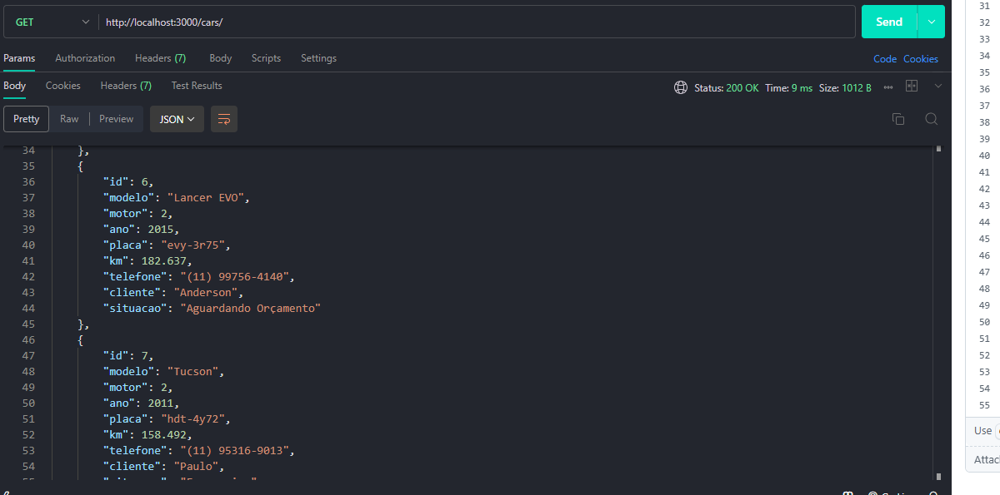
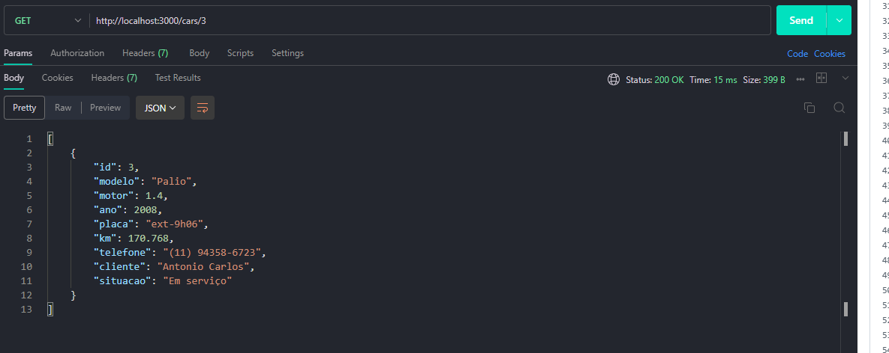
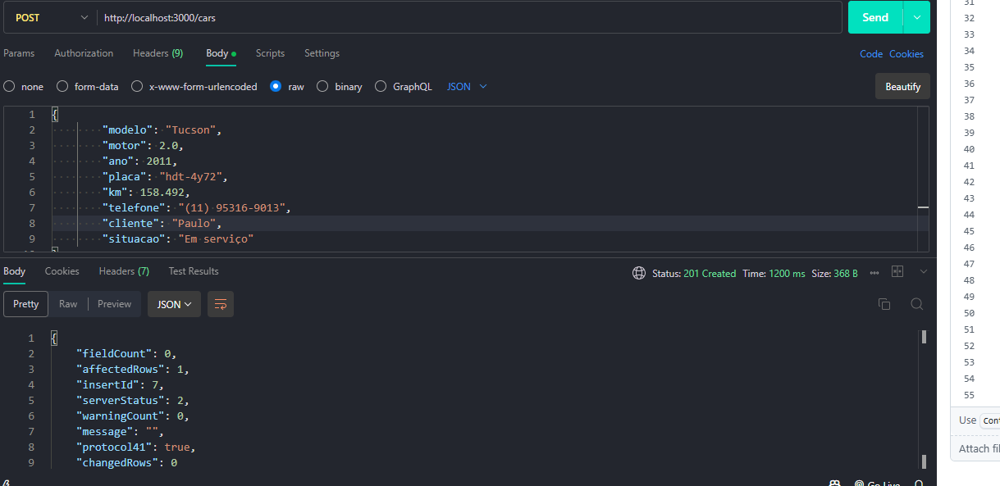
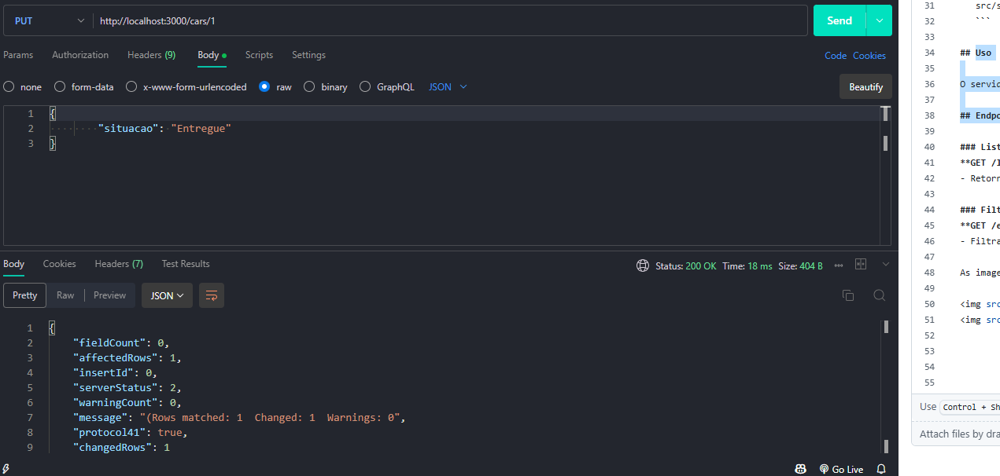
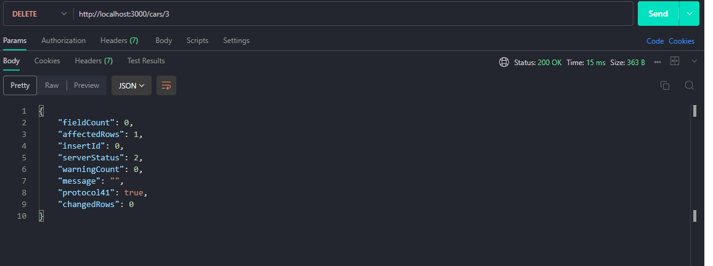

# 🚗 Sistema de Gerenciamento de Oficina

Projeto de API REST para gerenciar veículos dentro de uma oficina. A aplicação permite cadastrar, listar, atualizar e remover carros do sistema.

---

## 🧰 Tecnologias usadas

- Node.js
- Express
- MySQL
- Dotenv (para variáveis de ambiente)

---

## 🚀 Como rodar o projeto

1. Clone o repositório:
   ```bash
   git clone https://github.com/lucasemanoel3103/gerenciamento-oficina

2. Instale as dependências:

 npm install

3. Configure o .env com suas credenciais do banco de dados:

- DB_HOST=localhost

- DB_USER=root

- DB_PASSWORD=sua_senha

- DB_NAME=nome_do_banco
   
4. Rode o projeto:

npm run dev

🛣️ Rotas da API:

- GET	        /carros	   -     Lista todos os carros cadastrados no sistema 

- GET	        /carros/:id	 -   Lista um carro específico por ID

- POST	    /carros	   -     Cadastra um novo carro no sistema 

- PUT	        /carros/:id	 -   Atualiza a situação do carro dentro da oficina

- DELETE	    /carros/:id	-    Remove um carro do sistema

🗃️ Estrutura do banco de dados:

Tabela: carros

- id	        INT (PK):	            Identificador do carro

- modelo	    VARCHAR:	                Modelo do carro

- motor       DECIMAL:                 Motorização do carro

- placa	    VARCHAR:	                Placa do carro (única)

- ano	        INT:                    Ano de fabricação

- situacao	VARCHAR:	                Situação na oficina (ex: Arguardando orçamento, Pronto, etc)

- telefone    VARCHAR:                 Telefone do cliente para contato

- cliente     VARCHAR:                 Nome do dono do veiculo

- km          DECIMAL:                 Pra controle dos serviços a serem feitos

✅ Funcionalidades já implementadas:

- Conexão com banco MySQL
 
- CRUD completo de carros
 
- Separação de arquivos (rotas, controllers, repositories)
 
- Atualização de status do carro dentro da oficina

As imagens abaixo mostram exemplos de requisições feitas no Postman:

Get /cars



Get /cars/id



Post /cars



Put /cars/id



Delete /cars/id




🚀 Futuro do Projeto
Este projeto está em constante evolução e, futuramente, pretendo adicionar novas funcionalidades, como:

- Integração com pagamento: Para controle de custos de serviços realizados na oficina.

- Gestão de clientes: Para registrar informações dos clientes e associá-las aos carros.

- Notificações: Enviar notificações para os clientes sobre o status dos carros.

- Dashboard de visualização: Interface com gráficos para facilitar o gerenciamento de dados.

A ideia é expandir o sistema para torná-lo mais completo e adaptável às necessidades de uma oficina real.


